# 📚 Build Reading App
Ứng dụng đọc sách điện tử (EPUB, PDF), hỗ trợ ghi chú và quản lý thư viện cá nhân.

## 🚀 Công nghệ sử dụng
- Android (Kotlin)
- Spring Boot
- MySQL

## ✨ Tính năng
- Đăng nhập/Đăng ký/Quên mật khẩu
### Quản lý
- Quản lý sách đăng tải
- Quản lý thể loại
- Quản lý tác giả
- Quản lý bình luận (từng cuốn sách)
- Thống kê sách
  
### Người dùng
- Giao diện trang chủ giới thiệu sách/giới thiệu nội dung từng cuốn sách
- Chức năng tìm kiếm sách (theo thể loại/tên/hình ảnh sách)
- Thông báo (sách cập nhật, đăng tải sách)
- Quản lý thư viện, tiến độ đọc sách đã lưu
- Đọc sách, ghi chú, đánh dấu trang, bình luận sách, cài đặt chế độ đọc, tìm kiếm nội dung trong sách...
### Hỗ trợ ngôn ngữ (VN/EN)

## 📸 Demo

## 📂 Cấu trúc dự án
- /backend → API Spring Boot, Kotlin
- /android → App Android
- /database -> MySQL
--------------------------------------------

# DIAGRAM
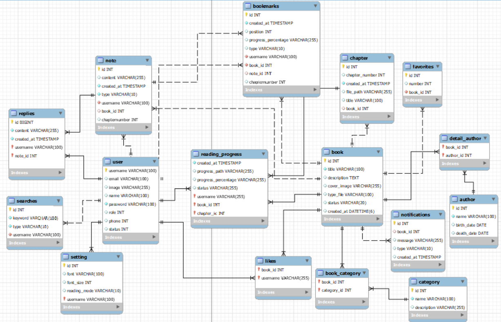

# Giao diện

## Giao diện người dùng (cơ bản)
### Trang chủ
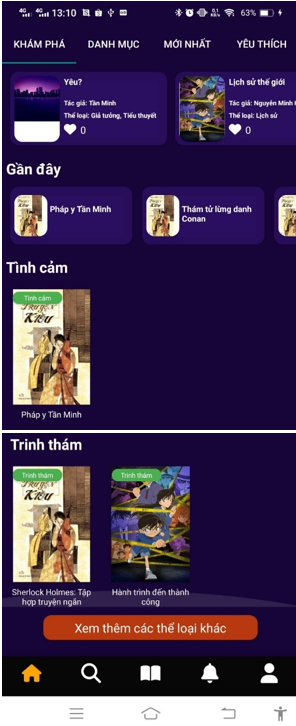

### Thông tin sách
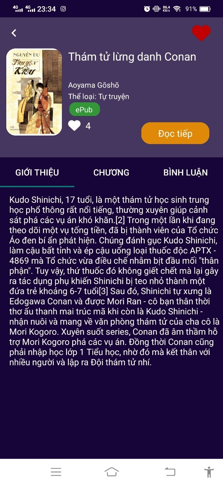

#### Chương
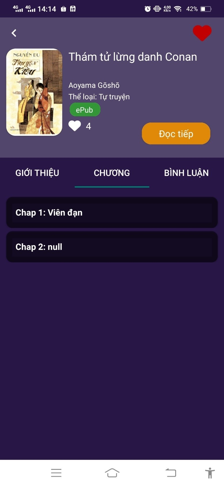

#### Bình luận
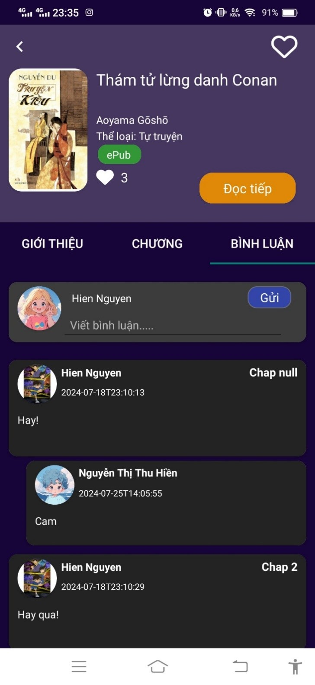

### Tìm kiếm
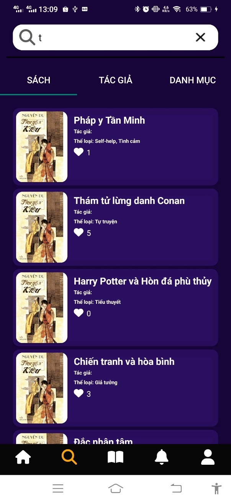

### Thư viện
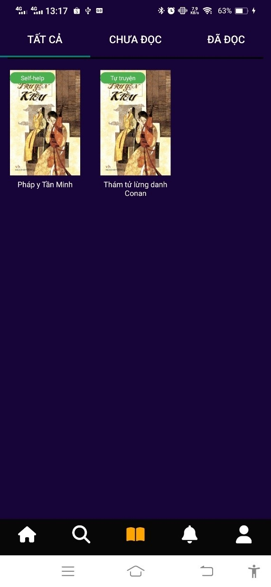

### Thông báo
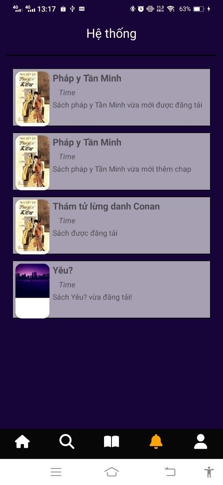

### Đọc sách
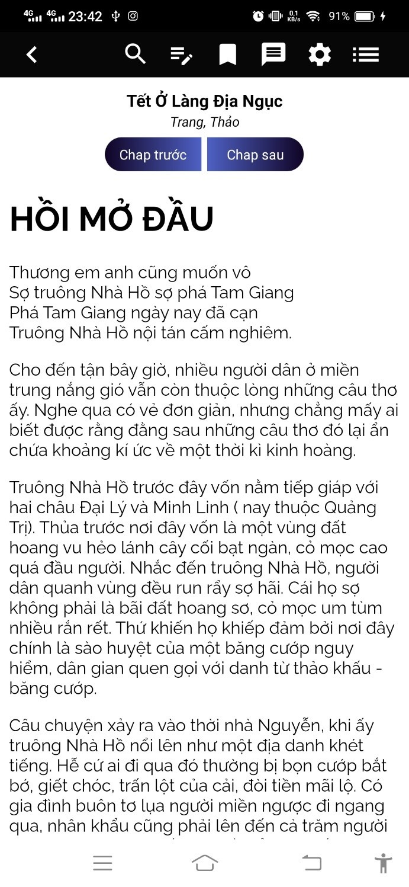

#### Ghi chú
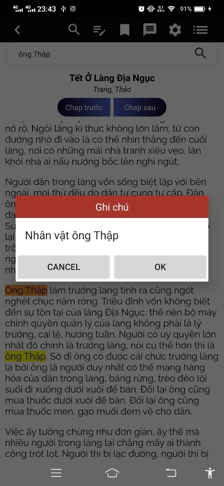

#### Tìm kiếm nội dung

#### Cài đặt chế độ đọc
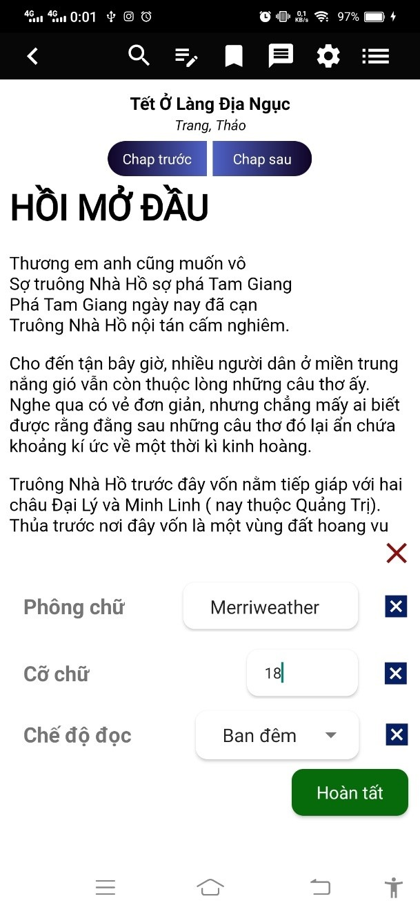

## Giao diện quản lý (cơ bản)

